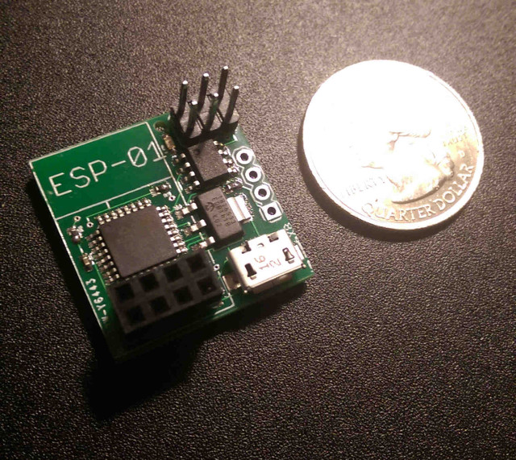
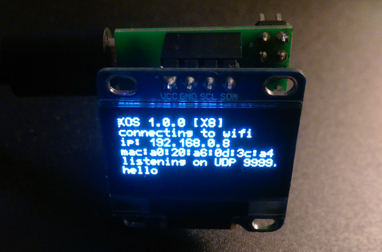
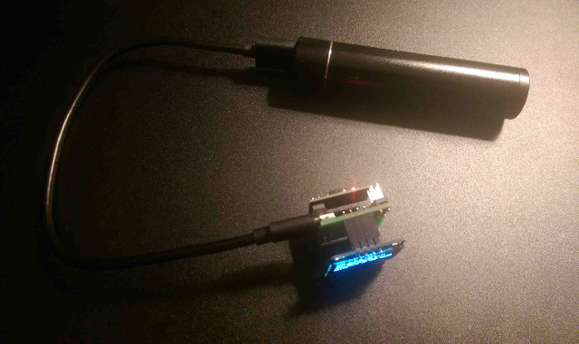
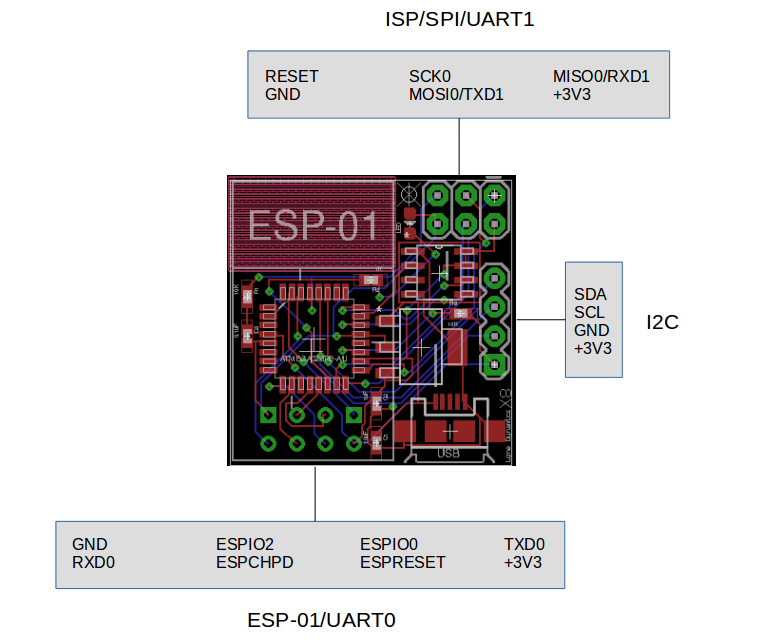
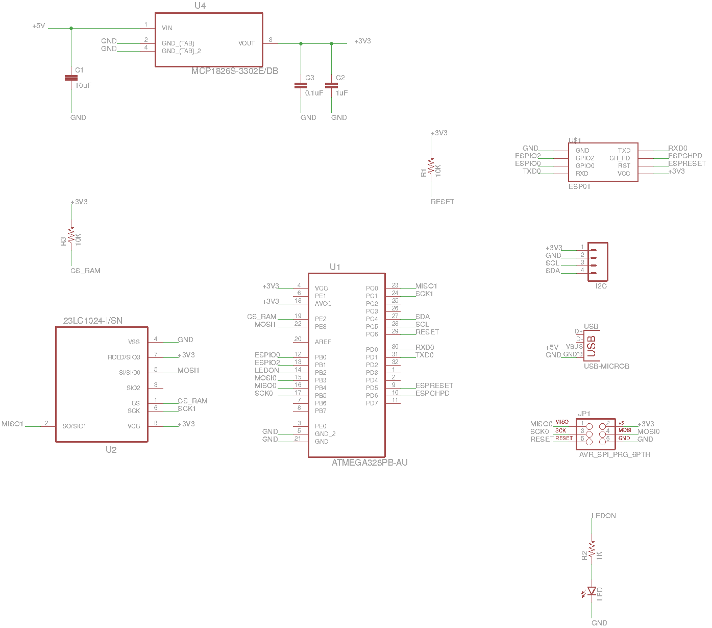

# X8 computer

## Overview

X8 is a small low-cost low-power computer designed by Lone Dynamics.

## Specifications

| | |
| --- | --- |
| Dimensions | 1in x 1in (25.4mm x 25.4mm) | | | |
| Processor | 8-bit ATmega328PB (2KB SRAM / 32KB Flash) @ 8MHz |
| Memory | 1Mb (128KB) SRAM via SPI @ 4MHz |
| Wireless | ESP-01 WiFi module via UART0 (optional) |
| Display | 128x64 OLED display module via I2C (optional) |
| Power | MicroUSB (1A onboard regulator) |

## Photos

## Pinout

## Schematics

